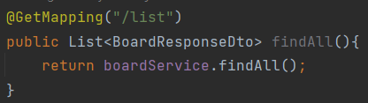

## [Spring Boot] Rest API를 이용한 게시판 기능 구현하기
* * *
### 1. 프로젝트 목표
기본적인 JAVA와 Spring에 대한 이해도를 높이기 위해 간단한 게시판 CRUD를 구축함

### 2. 사용 기술

라이브러리 / 프레임워크
- JAVA 11
- Spring boot 2.7.14
- JPA(Spring Data JPA)
- MySQL
- Lombok

#### 전반적인 구현 프로세스

스프링부트 패키지 구조

Controller : 클라이언트의 요청과 응답 처리

Repository : 데이터베이스에 직접적으로 접근

Service : 사용자가 요청하는 비즈니스 로직을 수행 ex) 데이터 저장, 

### 3. 구조 및 설계

#### Board Table

| Field | Type | hits | title|
|-------|------|------|-----|
| 테스트1  | 테스트2 | 테스트3 |
| 테스트1  | 테스트2 | 테스트3 |
| 테스트1  | 테스트2 | 테스트3 |

#### API 설계
| 기능              | Method | URL              |
|-----------------|--------|------------------|
| 게시글 상세보기        | GET    | /{id}            |
| 게시글 저장하기        | POST   | /save            |
| 게시글 전체 목록 조회    | GET    | /list            |
| 해당 작성자 게시글 조회하기 | GET    | /w_list/{writer} |
| 해당 제목 게시글 조회하기  | GET    | /t_list/{title}  | 
| 게시글 수정하기        | PUT    | /update/{id}     |
| 게시글 삭제하기        | GET    | /delete/{id}     |

* * * 
### 세부 기능

1. 게시글 상세보기

사용자가 localhost:8082/list를 요청하면 전체 게시판 리스트를 볼 수 있다.
boardService에서 처리하는 findAll() 메서드를 실행하면 